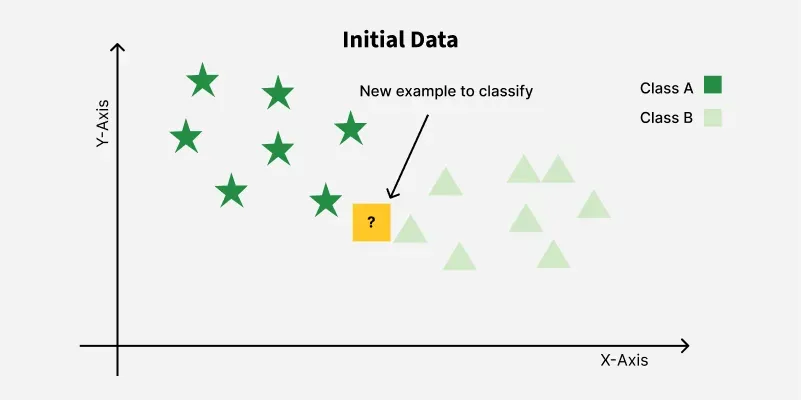
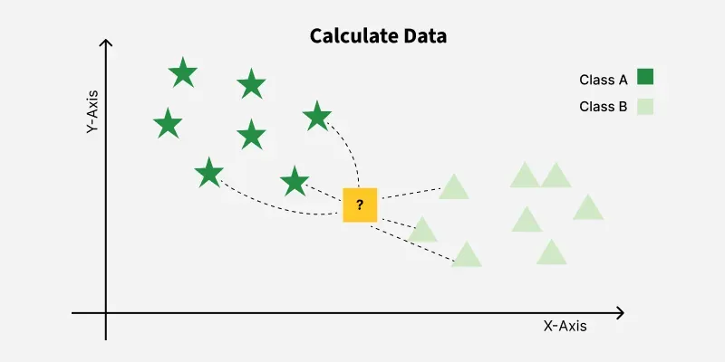
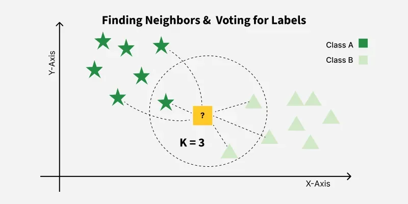

## {background-color="#1A2E5A"}

<div style="display:flex; height:70%; align-items:center; justify-content:center;">
<p style="color:white; font-size:2.5em; font-weight:bold; text-align:center;">Theorie</p>
</div>

---

## Was ist KNN?

<div style="display: flex; gap: 40px; align-items: flex-start;">

<div style="flex: 1;">

- **Klassifikation & Regression**
- **Nicht-parametrisch** — keine Annahmen über Datenverteilung
- **Lazy Learner** — kein Training
- Speichert den **gesamten Datensatz**
- Vorhersage: **k ähnlichste Punkte** suchen
  - Klassifikation → **Mehrheitsvote**
  - Regression → **Durchschnitt**

</div>

<div style="flex: 1; margin-top: 40px; position: relative; height: 380px;">



</div>

</div>

---

## {background-color="#1A2E5A"}

<div style="display:flex; height:70%; align-items:center; justify-content:center;">
<p style="color:white; font-size:2.5em; font-weight:bold; text-align:center;">Der k-Parameter</p>
</div>

---

## Der k-Parameter

> k = Anzahl der Nachbarn, die bei der Vorhersage abstimmen

- k = 3 → 3 nächste Punkte entscheiden
- **Klein** → Overfitting
- **Groß** → Underfitting

::: {style="background:#FEF9E7; border-left:4px solid #F0A500; padding:10px 14px; border-radius:4px; margin-top:16px;"}
Ungerade k-Werte → kein Gleichstand
:::

---

## k-Wert auswählen

::: {.columns}

::: {.column width="33%"}
::: {style="background:#FDECEA; border-left:5px solid #E74C3C; padding:16px; border-radius:4px;"}
**Cross-Validation**

- Datensatz aufteilen
- Auf Teilmengen testen
- Bestes k ermitteln
:::
:::

::: {.column width="33%"}
::: {style="background:#E8F8F5; border-left:5px solid #0E8A7C; padding:16px; border-radius:4px;"}
**Elbow-Methode**

- Fehlerrate vs. k plotten
- „Knick" identifizieren
- Ab dort kein Gewinn mehr
:::
:::

::: {.column width="33%"}
::: {style="background:#EBF5FB; border-left:5px solid #2E86C1; padding:16px; border-radius:4px;"}
**Faustregel**

- k ungerade wählen
- Startpunkt: $k = \sqrt{n}$
:::
:::

:::


---

## {background-color="#1A2E5A"}

<div style="display:flex; height:70%; align-items:center; justify-content:center;">
<p style="color:white; font-size:2.5em; font-weight:bold; text-align:center;">Distanzmetriken</p>
</div>

---

## Euklidischer Abstand

**Gerade Linie** zwischen zwei Punkten

$$d(x, X_i) = \sqrt{\sum_{j=1}^{p}(x_j - X_{ij})^2}$$

- Standardmaß bei KNN
- Für skalierte, kontinuierliche Features
- Geometrische Distanz

---

## Manhattan-Abstand

**Gitterartige Pfade** — „Taxicab-Distanz"

$$d(x, y) = \sum_{i=1}^{p} |x_i - y_i|$$

- Hochdimensionale Daten
- Features mit verschiedenen Skalen
- Robuster gegenüber Ausreißern

---

## Minkowski-Abstand

**Verallgemeinerung** von Euklidisch & Manhattan

$$d(x, y) = \left(\sum_{i=1}^{p} |x_i - y_i|^{p}\right)^{1/p}$$

| p | Entspricht |
|---|---|
| p = 1 | Manhattan |
| p = 2 | Euklidisch |
| p → ∞ | Chebyshev |

---

## {background-color="#1A2E5A"}

<div style="display:flex; height:70%; align-items:center; justify-content:center;">
<p style="color:white; font-size:2.5em; font-weight:bold; text-align:center;">Implementierung</p>
</div>

---

## Python — Von Grund auf

```{python}
#| eval: false
import numpy as np
from collections import Counter

def euclidean_distance(point1, point2):
    return np.sqrt(np.sum((np.array(point1) - np.array(point2))**2))

def knn_predict(training_data, training_labels, test_point, k):
    distances = []
    for i in range(len(training_data)):
        dist = euclidean_distance(test_point, training_data[i])
        distances.append((dist, training_labels[i]))

    distances.sort(key=lambda x: x[0])
    k_nearest = [label for _, label in distances[:k]]
    return Counter(k_nearest).most_common(1)[0][0]
```

---

## Scikit-Learn

```{python}
#| eval: false
from sklearn.neighbors import KNeighborsClassifier, KNeighborsRegressor
from sklearn.preprocessing import StandardScaler

scaler = StandardScaler()
X_train_s = scaler.fit_transform(X_train)   # fit nur auf Trainingsdaten
X_test_s  = scaler.transform(X_test)

knn = KNeighborsRegressor(
    n_neighbors = 5,
    metric      = "euclidean",
    weights     = "distance"
)
knn.fit(X_train_s, y_train)
y_pred = knn.predict(X_test_s)
```

::: {style="background:#FEF9E7; border-left:4px solid #F0A500; padding:10px 14px; border-radius:4px; margin-top:16px; font-size:0.9em;"}
Skalierung vor KNN ist **Pflicht** — sonst dominieren große Einheiten den Abstand.
:::

---

## {background-color="#1A2E5A"}

<div style="display:flex; height:70%; align-items:center; justify-content:center;">
<p style="color:white; font-size:2.5em; font-weight:bold; text-align:center;">Anwendungen</p>
</div>

---

## Anwendungsgebiete

::: {.columns}

::: {.column width="50%"}

**Empfehlungssysteme**

- Netflix, Spotify, Amazon
- Ähnliche Nutzer → ähnliche Vorlieben

**Spam-Erkennung**

- Neue E-Mail mit bekannten Beispielen vergleichen

:::

::: {.column width="50%"}

**Kundensegmentierung**

- Einkaufsverhalten als Features

**Spracherkennung**

- Gesprochene Wörter bekannten Mustern zuordnen

:::

:::

. . .

::: {style="background:#E8F8F5; border-left:5px solid #0E8A7C; padding:10px 16px; border-radius:4px; margin-top:16px;"}
KNN überall dort stark, wo **Ähnlichkeit** das Kernprinzip ist.
:::

---

## {background-color="#1A2E5A"}

<div style="display:flex; height:70%; align-items:center; justify-content:center;">
<p style="color:white; font-size:2.5em; font-weight:bold; text-align:center;">Stärken & Schwächen</p>
</div>

---

## Stärken & Schwächen

::: {.columns}

::: {.column width="50%"}
**Stärken**

- Einfach zu verstehen & implementieren
- Keine Trainingsphase
- Wenige Parameter
- Nicht-parametrisch
- Klassifikation & Regression
:::

::: {.column width="50%"}
**Schwächen**

- Langsam bei großen Datensätzen
- Skalierung zwingend erforderlich
- Overfitting bei kleinem k
- Curse of Dimensionality
- Speicherintensiv
:::

:::

---

## Zusammenfassung

- **Lazy Learner** — kein Training, alles bei Vorhersage
- **Nicht-parametrisch** — keine Verteilungsannahmen
- **k** per Cross-Validation oder Elbow-Methode
- **Skalierung ist Pflicht**
- **Euklidisch** als Standardmaß
- Klein-k → Overfitting · Groß-k → Underfitting

---

## Danke! {background-color="#1A2E5A"}

::: {style="text-align:center; padding-top:60px; color:white; font-size:1.1em;"}
Gruppe 8 — Oscar Aparicio Gergely & Diego Felzmann
:::
